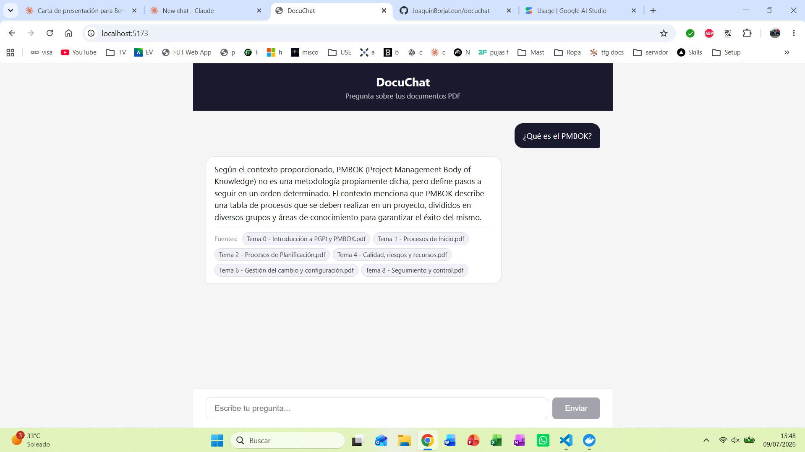
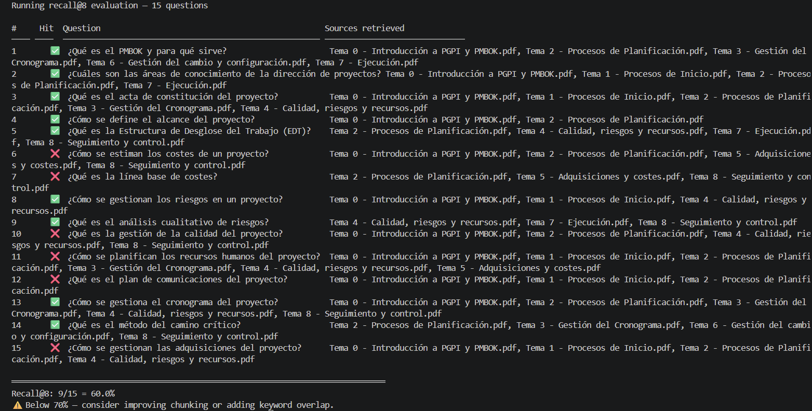
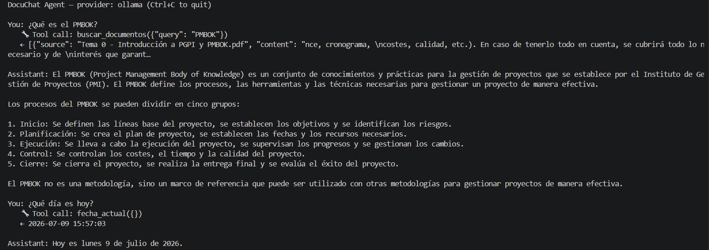
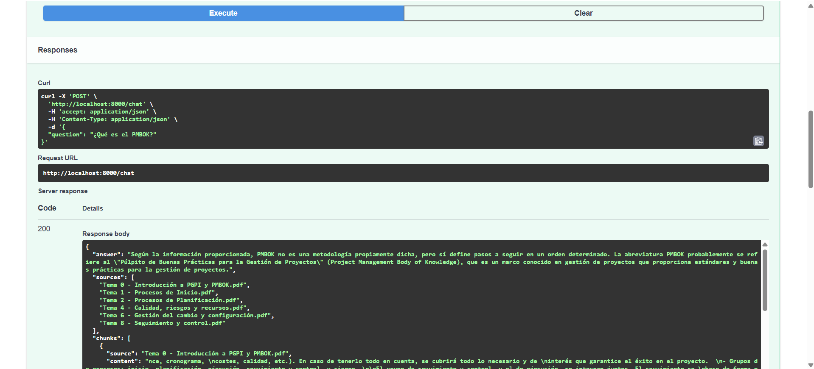

# DocuChat — RAG Conversational Assistant

A conversational assistant that answers questions about your PDF documents using
Retrieval-Augmented Generation (RAG), with source citations, an agent layer with
tool calling, and full observability. Runs entirely on local models (Ollama) or
a cloud provider (Gemini) — your choice.



## What it does

Upload PDFs, ask questions in natural language, and get answers grounded in your
documents — with the sources cited so you can verify where each answer came from.
It won't make things up: if the answer isn't in your documents, it says so.

## Tech stack

- **Backend:** Python, FastAPI
- **Vector store:** PostgreSQL + pgvector
- **Embeddings:** Ollama (`nomic-embed-text`, 768 dimensions)
- **LLM:** Ollama (local, e.g. `qwen2.5:7b` for RAG, `llama3.1:8b` for the agent) or Google Gemini (`gemini-2.5-flash`)
- **Frontend:** React (Vite)
- **Infrastructure:** Docker Compose (db + api + frontend)

## Architecture

```text
React frontend  ──HTTP──►  FastAPI  ──►  Hybrid retrieval (pgvector + full-text)
                                    ──►  LLM (Ollama / Gemini) with tool calling
                                    ──►  PostgreSQL (chunks + query logs)
```

## Key engineering decisions

### Hybrid search (vector + keyword)

Pure vector search failed on short queries with specific terms. For example,
"¿Qué es el PMBOK?" did not retrieve the chunk that defines PMBOK, even though it
existed — the cosine distances were all lukewarm (~0.35) and the correct chunk
never made the top-k. I diagnosed this by inspecting the distances and confirming
via SQL that the text was present, so the problem was semantic retrieval, not
ingestion. The fix was **hybrid search**: combining vector similarity with
PostgreSQL full-text search, fused with **Reciprocal Rank Fusion (RRF)**. The
chunk that was invisible to vector search jumped to position 1 thanks to the exact
keyword match.

### Honest evaluation (recall@k)

I built a 15-question evaluation set and measured recall@k. This turned out to
teach me as much as building the system:

- My first dataset was too strict (one valid source per question) → 60%,
  penalizing retrievals that were actually correct.
- I relaxed it to multiple valid sources... and overshot: I accepted the generic
  introduction as a valid source everywhere, which inflated recall to 93% —
  questions counted as hits even when the specific topic wasn't retrieved.
- I recalibrated to accept only topics that *specifically* answer each question.
  Honest recall@8: **60%**, with failures concentrated in broad conceptual
  questions (costs, quality, procurement).

The lesson: a badly designed evaluation metric is worse than no metric, because
it gives false confidence.



### Multi-provider agent with tool calling

The assistant is an agent, not just a retriever: it's given tools
(`buscar_documentos`, `fecha_actual`) and decides which to use per question. It
supports both a local provider (Ollama) and a cloud one (Gemini), selectable via
environment variable. I compared their tool-calling reliability — both chose tools
correctly, and I documented the trade-off: Ollama is free and private (nothing
leaves the machine), while Gemini gives slightly more polished answers at the cost
of a cloud dependency.



### Observability

Every query is logged (provider, question, tools used, chunks retrieved, latency)
so the system's behavior can be measured, not guessed.

## API

Interactive API docs are auto-generated by FastAPI at `/docs`.



## Running it

### With Docker (recommended)

Requires Docker and Ollama running on the host.

```bash
docker compose up --build
# Populate the database with your PDFs (placed in ./docs):
docker compose exec api python -m src.ingest
```

Frontend at `http://localhost:3000`, API at `http://localhost:8000`.

### Locally (development)

Requires PostgreSQL + pgvector and Ollama.

```bash
pip install -r requirements.txt
python -m src.ingest          # ingest PDFs from ./docs
uvicorn src.api:app --reload  # start the API
cd frontend && npm install && npm run dev  # start the frontend
```

## Future work

- Improve chunking (sentence/paragraph-based instead of character-based) to raise
  retrieval recall on conceptual questions.
- Add hybrid-search weighting configuration.
- Optional Claude provider (structure already in place).

---
Built by Joaquín Borja León.
